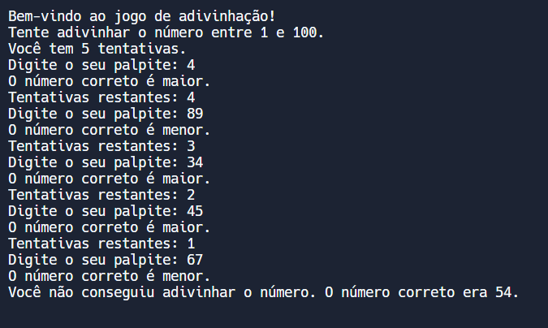

# JOGO DE ADVINHACAO EM C
👨‍💻ESSE É PEQUENO JOGO QUE RODA NO CONSOLE DA IDE.

 <br>

## DESCRIÇÃO:
O **Jogo de Adivinhação de Números** é um jogo simples onde o computador escolhe um número aleatório entre 1 e 100. O jogador tem um número limitado de tentativas para adivinhar esse número. A cada tentativa, o computador informa se o número correto é maior ou menor do que o palpite do jogador. O jogo termina quando o jogador adivinha o número ou esgota suas tentativas.

## EXECUTANDO O JOGO:
### COMO EXECUTAR O CÓDIGO?
1. **Compilar o Código:**
   - Compile o código com o seguinte comando (certifique-se de ter o compilador GCC instalado):

     ```bash
     gcc -o CODIGO CODIGO.c
     ```

2. **Executar o Programa:**
   - Execute o programa com o comando:

     ```bash
     ./CODIGO
     ```

### COMO JOGAR?
1. **Início do Jogo:**
   - O jogo começa com o computador gerando um número aleatório entre 1 e 100. Você tem 5 tentativas para adivinhar o número.

2. **Fazer Palpites:**
   - Insira um número entre 1 e 100 como seu palpite. O computador informará se o número correto é maior ou menor do que o seu palpite.

3. **Tentativas:**
   - Você tem um número limitado de tentativas para acertar o número. Após cada palpite, o número de tentativas restantes será exibido.

4. **Resultado:**
   - O jogo terminará quando você adivinhar o número ou esgotar suas tentativas. O número correto será revelado se você não adivinhar.

## NÃO SABE?
- Entendemos que para manipular arquivos em muitas linguagens e tecnologias, é necessário possuir conhecimento nessas áreas. Para auxiliar nesse aprendizado, oferecemos cursos gratuitos disponíveis:
* [CURSO DE C](https://github.com/VILHALVA/CURSO-DE-C)
* [CONFIRA MAIS CURSOS](https://github.com/VILHALVA?tab=repositories&q=+topic:CURSO)

## CREDITOS:
- [PROJETO CRIADO PELO VILHALVA](https://github.com/VILHALVA)
